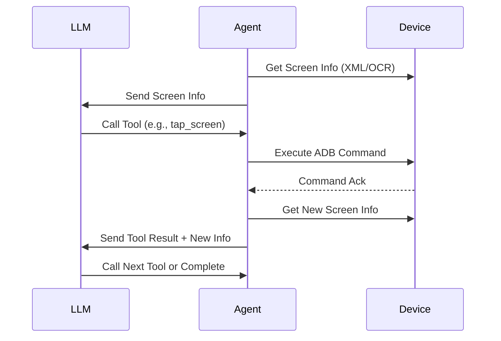

# `SKILLS.md` - Tool Calling Guide for DailyCheck-Agent

This document describes how to define and call tools within the DailyCheck-Agent for mobile device automation. The agent utilizes an LLM to interpret screen information and execute actions via ADB commands.

## 1. Overview

DailyCheck-Agent operates on a **Perception-Decision-Action** loop:
1.  **Perception:** The agent receives structured information about the current Android screen (UI elements, text, coordinates).
2.  **Decision:** The LLM analyzes the information and decides which tool to call.
3.  **Action:** The agent executes the tool via ADB, updates the screen state, and reports the result back to the LLM.

## 2. Available Tools

The following tools are available for the LLM to invoke. All coordinates use a standard Cartesian system where `(0, 0)` is the **top-left corner** of the screen.

### 2.1 `tap_screen`
Clicks on a specific coordinate on the screen.

| Parameter | Type    | Description                        |
| --------- | ------- | ---------------------------------- |
| `x`       | integer | X coordinate (horizontal position) |
| `y`       | integer | Y coordinate (vertical position)   |

**Definition:**
```json
{
    "type": "function",
    "function": {
        "name": "tap_screen",
        "description": "Click on a specific coordinate on the screen",
        "parameters": {
            "type": "object",
            "properties": {
                "x": {"type": "integer", "description": "Horizontal coordinate"},
                "y": {"type": "integer", "description": "Vertical coordinate"}
            },
            "required": ["x", "y"]
        }
    }
}
```

**Example Call:**
```json
{
    "name": "tap_screen",
    "arguments": {"x": 540, "y": 960}
}
```

### 2.2 `slide_screen`
Performs a swipe/drag gesture from one coordinate to another. Useful for scrolling or unlocking patterns.

| Parameter  | Type    | Description                                          |
| ---------- | ------- | ---------------------------------------------------- |
| `start_x`  | integer | Starting X coordinate                                |
| `start_y`  | integer | Starting Y coordinate                                |
| `end_x`    | integer | Ending X coordinate                                  |
| `end_y`    | integer | Ending Y coordinate                                  |
| `duration` | integer | Duration of the swipe in milliseconds (default: 300) |

**Definition:**
```json
{
    "type": "function",
    "function": {
        "name": "slide_screen",
        "description": "Swipe from one point to another on the screen",
        "parameters": {
            "type": "object",
            "properties": {
                "start_x": {"type": "integer"},
                "start_y": {"type": "integer"},
                "end_x": {"type": "integer"},
                "end_y": {"type": "integer"},
                "duration": {"type": "integer", "default": 300}
            },
            "required": ["start_x", "start_y", "end_x", "end_y"]
        }
    }
}
```

### 2.3 `press_key`
Simulates pressing a hardware or system key (e.g., Back, Home, Enter).

| Parameter  | Type           | Description                                             |
| ---------- | -------------- | ------------------------------------------------------- |
| `key_code` | integer/string | Key code number or name (e.g., "HOME", "BACK", "ENTER") |

**Common Key Codes:**
- `HOME`: 3
- `BACK`: 4
- `ENTER`: 66
- `APP_SWITCH`: 187

**Definition:**
```json
{
    "type": "function",
    "function": {
        "name": "press_key",
        "description": "Press a system key (Home, Back, etc.)",
        "parameters": {
            "type": "object",
            "properties": {
                "key_code": {"type": "string", "description": "Key name like HOME, BACK, ENTER"}
            },
            "required": ["key_code"]
        }
    }
}
```

### 2.4 `input_text`
Inputs text into the currently focused field.

| Parameter | Type   | Description              |
| --------- | ------ | ------------------------ |
| `text`    | string | The text string to input |

**Definition:**
```json
{
    "type": "function",
    "function": {
        "name": "input_text",
        "description": "Input text into the focused field",
        "parameters": {
            "type": "object",
            "properties": {
                "text": {"type": "string", "description": "Text to type"}
            },
            "required": ["text"]
        }
    }
}
```

### 2.5 `task_complete`
Signals that the assigned task is finished.

**Definition:**
```json
{
    "type": "function",
    "function": {
        "name": "task_complete",
        "description": "Mark the current task as successfully completed",
        "parameters": {
            "type": "object",
            "properties": {
                "summary": {"type": "string", "description": "Brief summary of what was achieved"}
            },
            "required": []
        }
    }
}
```

## 3. Message Flow

The interaction follows a strict request-response cycle:

1.  **System Init:** Agent captures initial screen UI hierarchy (via `uiautomator dump` or similar).
2.  **User Prompt:** Agent sends screen info to LLM.
3.  **LLM Decision:** LLM returns a tool call (or text explanation + tool call).
4.  **Execution:** Agent executes the ADB command corresponding to the tool.
5.  **Feedback:** Agent captures the **new** screen state and sends it as a `tool_response`.
6.  **Loop:** Repeat until `task_complete` is called or a maximum step limit is reached.



## 4. Message Structure

### 4.1 User Message (Screen Context)
```json
{
    "role": "user",
    "content": "Current Screen Analysis:\n- Resolution: 1080x1920\n- Elements:\n  1. Text: 'Login', Bounds: [400, 800][680, 900]\n  2. Button: 'Submit', Bounds: [400, 1000][680, 1100]\n\nTask: Log in to the app."
}
```

### 4.2 Assistant Response (Tool Call)
```json
{
    "role": "assistant",
    "content": "I will click the 'Login' button to proceed.",
    "tool_calls": [
        {
            "id": "call_unique_id_001",
            "type": "function",
            "function": {
                "name": "tap_screen",
                "arguments": "{\"x\": 540, \"y\": 850}"
            }
        }
    ]
}
```

### 4.3 Tool Result (Feedback)
```json
{
    "role": "tool",
    "tool_call_id": "call_unique_id_001",
    "name": "tap_screen",
    "content": "Action Successful. New Screen Elements:\n- Text: 'Welcome User'\n- Button: 'Start'\n\nUI State: Changed."
}
```

## 5. Best Practices

### 5.1 Context Awareness
Always include the **result of the action** and the **new screen state** in the tool response. The LLM cannot see the screen; it relies entirely on this text description.
```python
# Good
response = f"Clicked ({x}, {y}). New screen shows 'Home Page'."

# Bad
response = "OK"
```

### 5.2 Timing & Stability
Android UIs take time to render. Always implement a wait strategy after actions.
- **Standard Tap:** Wait `1.5s - 2.0s`.
- **App Launch:** Wait `3.0s - 5.0s`.
- **Network Request:** Wait until specific UI elements appear (if detectable).

```python
import time
def execute_tool(tool_name, args):
    # ... execute adb command ...
    time.sleep(2)  # Critical for UI stability
    return get_screen_info()
```

### 5.3 Handling LLM Hallucinations
If the LLM returns text without a tool call when an action is required:
```python
if not tool_calls:
    messages.append({
        "role": "user",
        "content": "No action was taken. Please call a tool (tap_screen, slide_screen, etc.) to interact with the device, or call task_complete if finished."
    })
```

### 5.4 Coordinate Normalization
Ensure coordinates are within screen bounds.
- Validate `0 <= x <= width` and `0 <= y <= height`.
- If using relative coordinates (0.0-1.0), convert to absolute pixels before calling the tool.

## 6. Configuration

### 6.1 Environment Variables
```python
# Path to ADB executable
ADB_PATH = "scrcpy/adb.exe" 

# Device Serial (optional, defaults to connected device)
DEVICE_SERIAL = "emulator-5554" 

# Max retry attempts for failed actions
MAX_RETRIES = 3
```

### 6.2 Tool Registration
Ensure all tools are registered in the LLM client configuration:
```python
tools = [
    tap_screen_def,
    slide_screen_def,
    press_key_def,
    input_text_def,
    task_complete_def
]
```

## 7. Error Handling

| Issue                     | Cause                           | Solution                                                |
| ------------------------- | ------------------------------- | ------------------------------------------------------- |
| `uiautomator dump failed` | Device busy or locked           | Unlock screen, wait, and retry.                         |
| `XML parse error`         | Invalid UI hierarchy            | Strip non-XML headers from dump output.                 |
| `No elements found`       | Blank screen or native view     | Use `slide_screen` to refresh or fallback to OCR.       |
| `Tap not registering`     | Clicked on non-interactive area | Verify coordinates against UI bounds; add `time.sleep`. |
| `ADB unauthorized`        | RSA key not accepted            | Check device screen for "Allow USB debugging" prompt.   |
| `Connection lost`         | USB/WiFi disconnected           | Re-establish connection before retrying.                |

## 8. Integration with DailyCheck

When integrating with the `tasks.yml` workflow:
1.  **Define Goal:** Clearly state the objective (e.g., "Clock in at 9:00 AM").
2.  **Map Tools:** Ensure the required tools (e.g., `input_text` for passwords) are enabled.
3.  **Timeouts:** Set a global timeout for the agent loop to prevent infinite hangs.
4.  **Logging:** Log all tool calls and screen states for audit and debugging.