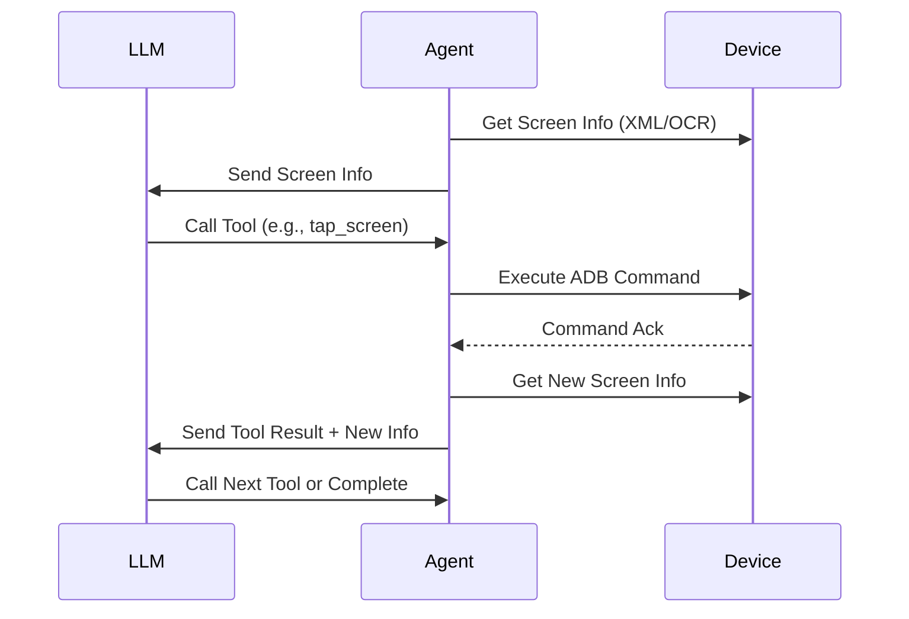

# `SKILLS.md` - Tool Calling Guide for DailyCheck-Agent

This document describes how to define and call tools within the DailyCheck-Agent for mobile device automation. The agent utilizes an LLM to interpret screen information and execute actions via ADB commands.

## 1. Overview

DailyCheck-Agent operates on a **Perception-Decision-Action** loop:
1.  **Perception:** The agent receives structured information about the current Android screen (UI elements, text, coordinates).
2.  **Decision:** The LLM analyzes the information and decides which tool to call.
3.  **Action:** The agent executes the tool via ADB, updates the screen state, and reports the result back to the LLM.

## 2. Available Tools

The following tools are available for the LLM to invoke. All coordinates use a standard Cartesian system where `(0, 0)` is the **top-left corner** of the screen.

### 2.1 `tap_screen`
Clicks on a specific coordinate on the screen.

| Parameter | Type    | Description                        |
| --------- | ------- | ---------------------------------- |
| `x`       | integer | X coordinate (horizontal position) |
| `y`       | integer | Y coordinate (vertical position)   |

**Definition:**
```json
{
    "type": "function",
    "function": {
        "name": "tap_screen",
        "description": "Click on a specific coordinate on the screen",
        "parameters": {
            "type": "object",
            "properties": {
                "x": {"type": "integer", "description": "Horizontal coordinate"},
                "y": {"type": "integer", "description": "Vertical coordinate"}
            },
            "required": ["x", "y"]
        }
    }
}
```

**Example Call:**
```json
{
    "name": "tap_screen",
    "arguments": {"x": 540, "y": 960}
}
```

### 2.2 `slide_screen`
Performs a swipe/drag gesture from one coordinate to another. Useful for scrolling or unlocking patterns.

| Parameter  | Type    | Description                                          |
| ---------- | ------- | ---------------------------------------------------- |
| `start_x`  | integer | Starting X coordinate                                |
| `start_y`  | integer | Starting Y coordinate                                |
| `end_x`    | integer | Ending X coordinate                                  |
| `end_y`    | integer | Ending Y coordinate                                  |
| `duration` | integer | Duration of the swipe in milliseconds (default: 300) |

**Definition:**
```json
{
    "type": "function",
    "function": {
        "name": "slide_screen",
        "description": "Swipe from one point to another on the screen",
        "parameters": {
            "type": "object",
            "properties": {
                "start_x": {"type": "integer"},
                "start_y": {"type": "integer"},
                "end_x": {"type": "integer"},
                "end_y": {"type": "integer"},
                "duration": {"type": "integer", "default": 300}
            },
            "required": ["start_x", "start_y", "end_x", "end_y"]
        }
    }
}
```

### 2.3 `press_key`
Simulates pressing a hardware or system key (e.g., Back, Home, Enter).

| Parameter  | Type           | Description                                             |
| ---------- | -------------- | ------------------------------------------------------- |
| `key_code` | integer/string | Key code number or name (e.g., "HOME", "BACK", "ENTER") |

**Common Key Codes:**
- `HOME`: 3
- `BACK`: 4
- `ENTER`: 66
- `APP_SWITCH`: 187

**Definition:**
```json
{
    "type": "function",
    "function": {
        "name": "press_key",
        "description": "Press a system key (Home, Back, etc.)",
        "parameters": {
            "type": "object",
            "properties": {
                "key_code": {"type": "string", "description": "Key name like HOME, BACK, ENTER"}
            },
            "required": ["key_code"]
        }
    }
}
```

### 2.4 `input_text`
Inputs text into the currently focused field.

| Parameter | Type   | Description              |
| --------- | ------ | ------------------------ |
| `text`    | string | The text string to input |

**Definition:**
```json
{
    "type": "function",
    "function": {
        "name": "input_text",
        "description": "Input text into the focused field",
        "parameters": {
            "type": "object",
            "properties": {
                "text": {"type": "string", "description": "Text to type"}
            },
            "required": ["text"]
        }
    }
}
```

### 2.5 `task_complete`
Signals that the assigned task is finished.

**Definition:**
```json
{
    "type": "function",
    "function": {
        "name": "task_complete",
        "description": "Mark the current task as successfully completed",
        "parameters": {
            "type": "object",
            "properties": {
                "summary": {"type": "string", "description": "Brief summary of what was achieved"}
            },
            "required": []
        }
    }
}
```

## 3. Message Flow

The interaction follows a strict request-response cycle:

1.  **System Init:** Agent captures initial screen UI hierarchy (via `uiautomator dump` or similar).
2.  **User Prompt:** Agent sends screen info to LLM.
3.  **LLM Decision:** LLM returns a tool call (or text explanation + tool call).
4.  **Execution:** Agent executes the ADB command corresponding to the tool.
5.  **Feedback:** Agent captures the **new** screen state and sends it as a `tool_response`.
6.  **Loop:** Repeat until `task_complete` is called or a maximum step limit is reached.



## 4. Message Structure

### 4.1 User Message (Screen Context)
```json
{
    "role": "user",
    "content": "Current Screen Analysis:\n- Resolution: 1080x1920\n- Elements:\n  1. Text: 'Login', Bounds: [400, 800][680, 900]\n  2. Button: 'Submit', Bounds: [400, 1000][680, 1100]\n\nTask: Log in to the app."
}
```

### 4.2 Assistant Response (Tool Call)
```json
{
    "role": "assistant",
    "content": "I will click the 'Login' button to proceed.",
    "tool_calls": [
        {
            "id": "call_unique_id_001",
            "type": "function",
            "function": {
                "name": "tap_screen",
                "arguments": "{\"x\": 540, \"y\": 850}"
            }
        }
    ]
}
```

### 4.3 Tool Result (Feedback)
```json
{
    "role": "tool",
    "tool_call_id": "call_unique_id_001",
    "name": "tap_screen",
    "content": "Action Successful. New Screen Elements:\n- Text: 'Welcome User'\n- Button: 'Start'\n\nUI State: Changed."
}
```

## 5. Best Practices

### 5.1 Context Awareness
Always include the **result of the action** and the **new screen state** in the tool response. The LLM cannot see the screen; it relies entirely on this text description.
```python
# Good
response = f"Clicked ({x}, {y}). New screen shows 'Home Page'."

# Bad
response = "OK"
```

### 5.2 Timing & Stability
Android UIs take time to render. Always implement a wait strategy after actions.
- **Standard Tap:** Wait `1.5s - 2.0s`.
- **App Launch:** Wait `3.0s - 5.0s`.
- **Network Request:** Wait until specific UI elements appear (if detectable).

```python
import time
def execute_tool(tool_name, args):
    # ... execute adb command ...
    time.sleep(2)  # Critical for UI stability
    return get_screen_info()
```

### 5.3 Handling LLM Hallucinations
If the LLM returns text without a tool call when an action is required:
```python
if not tool_calls:
    messages.append({
        "role": "user",
        "content": "No action was taken. Please call a tool (tap_screen, slide_screen, etc.) to interact with the device, or call task_complete if finished."
    })
```

### 5.4 Coordinate Normalization
Ensure coordinates are within screen bounds.
- Validate `0 <= x <= width` and `0 <= y <= height`.
- If using relative coordinates (0.0-1.0), convert to absolute pixels before calling the tool.

## 6. Configuration

### 6.1 Configuration File (Recommended)

Create a YAML configuration file (e.g., `config.yml` or `.dailycheck.yml`) in your project directory or `~/.dailycheck/`:

```yaml
# Task configuration (optional, run all tasks if not specified)
# tasks:
#   - aliyunpan_checkin

api_provider: open-router
device_serial: "emulator-5554"  # Optional, auto-detect if not set
adb_path: "scrcpy/adb"          # Optional, auto-detect if not set
max_steps: 50
config_dir: "config"            # Directory containing tasks.yml and api.yml
```

### 6.2 Command Line Arguments

Command line arguments override configuration file values:

```bash
# Run all tasks (default behavior)
dailycheck

# Run specific task
dailycheck aliyunpan_checkin

# List all available tasks
dailycheck --list-tasks

# Specify config file
dailycheck --config /path/to/config.yml

# Override specific values
dailycheck --api-provider siliconflow --max-steps 100
```

### 6.3 Environment Variables (Highest Priority)

Environment variables override both config file and command line arguments:

```bash
export DAILYCHECK_API_PROVIDER=open-router
export DAILYCHECK_DEVICE_SERIAL=emulator-5554
export ADB_PATH=scrcpy/adb
export MAX_STEPS=50
export DAILYCHECK_CONFIG_DIR=config
```

### 6.4 Priority Order

**Command Line > Environment Variables > Config File > Defaults**

| Setting | CLI Arg | Env Variable | Default |
|---------|---------|--------------|---------|
| Task name | Positional arg | - | All tasks |
| API provider | `--api-provider` | `DAILYCHECK_API_PROVIDER` | `open-router` |
| Device serial | `--device-serial` | `DAILYCHECK_DEVICE_SERIAL` | Auto-detect |
| ADB path | `--adb-path` | `ADB_PATH` | `scrcpy/adb` |
| Max steps | `--max-steps` | `MAX_STEPS` | `50` |
| Config dir | `--config-dir` | `DAILYCHECK_CONFIG_DIR` | `config` |

### 6.5 Task Configuration

Tasks are defined in `config/tasks.yml`:

```yaml
tasks:
  aliyunpan_checkin:
    name: "阿里云盘签到"
    app: "阿里云盘"
    steps:
      - name: "Open app"
        description: "Tap the 阿里云盘 icon"
      - name: "Start check-in"
        description: "Tap the button that starts the daily check session"
```

### 6.6 Tool Registration
Ensure all tools are registered in the LLM client configuration:
```python
tools = [
    tap_screen_def,
    slide_screen_def,
    press_key_def,
    input_text_def,
    task_complete_def
]
```

## 7. Error Handling

| Issue                     | Cause                           | Solution                                                |
| ------------------------- | ------------------------------- | ------------------------------------------------------- |
| `uiautomator dump failed` | Device busy or locked           | Unlock screen, wait, and retry.                         |
| `XML parse error`         | Invalid UI hierarchy            | Strip non-XML headers from dump output.                 |
| `No elements found`       | Blank screen or native view     | Use `slide_screen` to refresh or fallback to OCR.       |
| `Tap not registering`     | Clicked on non-interactive area | Verify coordinates against UI bounds; add `time.sleep`. |
| `ADB unauthorized`        | RSA key not accepted            | Check device screen for "Allow USB debugging" prompt.   |
| `Connection lost`         | USB/WiFi disconnected           | Re-establish connection before retrying.                |

## 8. Ad Handling Guide

This section describes how to handle ad screens during task execution. **Ad handling is implemented via prompt engineering, not hard-coded logic.** The LLM decides when and how to close ads based on screen information.

### 8.1 Identifying Ad Screens

The LLM should analyze screen elements for ad-related keywords:

**Chinese Keywords:**
- `跳过` (skip), `关闭` (close), `关掉` (close)
- `广告` (advertisement)
- `×`, `x`, `✕`, `❌` (close symbols)
- `取消` (cancel), `不再提醒` (don't remind again), `稍后再说` (later)
- `知道了` (got it), `关闭广告` (close ad)

**English Keywords:**
- `skip`, `close`, `ad`, `advert`
- `skip ad`, `close`, `cancel`

### 8.2 Ad Handling Strategy

When the LLM detects ad-related elements in the screen information:

1. **Priority Check**: Before executing the main task flow, check if the current screen contains ad elements.
2. **Immediate Action**: If ad elements are detected, immediately call `tap_screen` to close the ad.
3. **Wait for Update**: After closing the ad, wait for the screen to update before continuing.
4. **Resume Task**: Once the ad is closed, resume the normal task execution.

### 8.3 Example Prompt for Ad Handling

Include the following guidance in the system prompt:

```markdown
## 广告处理（高优先级）
在开始执行任务前和每一步操作后，**必须先检查是否为广告页面**：
- 如果屏幕中出现 "跳过"、"关闭"、"广告"、"×"、"skip"、"close" 等关键词
- 或者屏幕中有明显的关闭按钮、跳过按钮
- **立即点击关闭/跳过按钮**，不要执行其他任务操作
- 等待广告关闭后，再继续执行正常任务流程
```

### 8.4 Implementation Notes

- **No Hard-coded Logic**: Ad detection and handling should be done by the LLM, not through hard-coded keyword matching in the agent code.
- **Flexibility**: This approach allows the agent to handle various ad formats and layouts that may change over time.
- **Task-Specific**: Different tasks may require different ad handling strategies; the LLM can adapt based on context.

## 9. Git Operations

The following tools are available for Git version control operations. These tools help manage code changes, commits, and repository operations.

### 9.1 `git_status`
Checks the current status of the Git repository, including staged, unstaged, and untracked files.

**Definition:**
```json
{
    "type": "function",
    "function": {
        "name": "git_status",
        "description": "Check the current Git repository status",
        "parameters": {
            "type": "object",
            "properties": {},
            "required": []
        }
    }
}
```

**Example Call:**
```json
{
    "name": "git_status",
    "arguments": {}
}
```

### 9.2 `git_add`
Stages files for commit.

| Parameter | Type   | Description                                    |
| --------- | ------ | ---------------------------------------------- |
| `files`   | array  | List of file paths to stage (or "." for all)   |

**Definition:**
```json
{
    "type": "function",
    "function": {
        "name": "git_add",
        "description": "Stage files for commit",
        "parameters": {
            "type": "object",
            "properties": {
                "files": {
                    "type": "array",
                    "items": {"type": "string"},
                    "description": "File paths to stage"
                }
            },
            "required": ["files"]
        }
    }
}
```

**Example Call:**
```json
{
    "name": "git_add",
    "arguments": {"files": ["src/main.py", "tests/test_main.py"]}
}
```

### 9.3 `git_diff`
Shows changes between commits, branches, or working directory.

| Parameter    | Type   | Description                                      |
| ------------ | ------ | ------------------------------------------------ |
| `target`     | string | Git target (e.g., "HEAD", "main", branch name)   |
| `staged`     | boolean| If true, show staged changes; otherwise working directory changes |

**Definition:**
```json
{
    "type": "function",
    "function": {
        "name": "git_diff",
        "description": "Show changes between commits or working directory",
        "parameters": {
            "type": "object",
            "properties": {
                "target": {"type": "string", "description": "Git target like HEAD, main, or branch name"},
                "staged": {"type": "boolean", "description": "Show staged changes if true"}
            },
            "required": []
        }
    }
}
```

**Example Call:**
```json
{
    "name": "git_diff",
    "arguments": {"target": "HEAD", "staged": false}
}
```

### 9.4 `git_commit`
Creates a new commit with staged changes.

| Parameter     | Type   | Description                                    |
| ------------- | ------ | ---------------------------------------------- |
| `message`     | string | Commit message                                 |

**Definition:**
```json
{
    "type": "function",
    "function": {
        "name": "git_commit",
        "description": "Create a new commit with staged changes",
        "parameters": {
            "type": "object",
            "properties": {
                "message": {"type": "string", "description": "Commit message"}
            },
            "required": ["message"]
        }
    }
}
```

**Example Call:**
```json
{
    "name": "git_commit",
    "arguments": {"message": "Fix bug in user authentication"}
}
```

### 9.5 `git_log`
Shows commit history.

| Parameter | Type    | Description                                    |
| --------- | ------- | ---------------------------------------------- |
| `limit`   | integer | Number of commits to show (default: 10)        |

**Definition:**
```json
{
    "type": "function",
    "function": {
        "name": "git_log",
        "description": "Show commit history",
        "parameters": {
            "type": "object",
            "properties": {
                "limit": {"type": "integer", "description": "Number of commits to show", "default": 10}
            },
            "required": []
        }
    }
}
```

**Example Call:**
```json
{
    "name": "git_log",
    "arguments": {"limit": 5}
}
```

### 9.6 `git_branch`
Lists or creates branches.

| Parameter | Type    | Description                                    |
| --------- | ------- | ---------------------------------------------- |
| `name`    | string  | Branch name to create (optional)               |
| `checkout`| boolean | If true, checkout the branch after creation    |

**Definition:**
```json
{
    "type": "function",
    "function": {
        "name": "git_branch",
        "description": "List or create Git branches",
        "parameters": {
            "type": "object",
            "properties": {
                "name": {"type": "string", "description": "Branch name to create"},
                "checkout": {"type": "boolean", "description": "Checkout branch after creation"}
            },
            "required": []
        }
    }
}
```

**Example Call:**
```json
{
    "name": "git_branch",
    "arguments": {"name": "feature/new-feature", "checkout": true}
}
```

### 9.7 `git_checkout`
Switches to a different branch.

| Parameter | Type   | Description                                    |
| --------- | ------ | ---------------------------------------------- |
| `branch`  | string | Branch name to checkout                        |

**Definition:**
```json
{
    "type": "function",
    "function": {
        "name": "git_checkout",
        "description": "Switch to a different branch",
        "parameters": {
            "type": "object",
            "properties": {
                "branch": {"type": "string", "description": "Branch name to checkout"}
            },
            "required": ["branch"]
        }
    }
}
```

**Example Call:**
```json
{
    "name": "git_checkout",
    "arguments": {"branch": "main"}
}
```

### 9.8 `git_pull`
Fetches and merges changes from remote repository.

| Parameter | Type   | Description                                    |
| --------- | ------ | ---------------------------------------------- |
| `remote`  | string | Remote name (default: "origin")                |
| `branch`  | string | Branch to pull from (default: current branch)  |

**Definition:**
```json
{
    "type": "function",
    "function": {
        "name": "git_pull",
        "description": "Fetch and merge changes from remote repository",
        "parameters": {
            "type": "object",
            "properties": {
                "remote": {"type": "string", "description": "Remote name", "default": "origin"},
                "branch": {"type": "string", "description": "Branch to pull from"}
            },
            "required": []
        }
    }
}
```

**Example Call:**
```json
{
    "name": "git_pull",
    "arguments": {"remote": "origin", "branch": "main"}
}
```

### 9.9 `git_push`
Pushes commits to remote repository.

| Parameter | Type    | Description                                    |
| --------- | ------- | ---------------------------------------------- |
| `remote`  | string  | Remote name (default: "origin")                |
| `branch`  | string  | Branch to push to (default: current branch)    |
| `force`   | boolean | Force push (use with caution)                  |

**Definition:**
```json
{
    "type": "function",
    "function": {
        "name": "git_push",
        "description": "Push commits to remote repository",
        "parameters": {
            "type": "object",
            "properties": {
                "remote": {"type": "string", "description": "Remote name", "default": "origin"},
                "branch": {"type": "string", "description": "Branch to push to"},
                "force": {"type": "boolean", "description": "Force push", "default": false}
            },
            "required": []
        }
    }
}
```

**Example Call:**
```json
{
    "name": "git_push",
    "arguments": {"remote": "origin", "branch": "main", "force": false}
}
```

### 9.10 `git_merge`
Merges one branch into the current branch.

| Parameter | Type   | Description                                    |
| --------- | ------ | ---------------------------------------------- |
| `branch`  | string | Branch to merge into current branch            |

**Definition:**
```json
{
    "type": "function",
    "function": {
        "name": "git_merge",
        "description": "Merge a branch into the current branch",
        "parameters": {
            "type": "object",
            "properties": {
                "branch": {"type": "string", "description": "Branch to merge"}
            },
            "required": ["branch"]
        }
    }
}
```

**Example Call:**
```json
{
    "name": "git_merge",
    "arguments": {"branch": "feature/new-feature"}
}
```

### 9.11 `git_stash`
Temporarily saves changes without committing.

| Parameter | Type    | Description                                    |
| --------- | ------- | ---------------------------------------------- |
| `message` | string  | Optional stash message                         |
| `pop`     | boolean | If true, apply and remove the latest stash     |

**Definition:**
```json
{
    "type": "function",
    "function": {
        "name": "git_stash",
        "description": "Temporarily save changes without committing",
        "parameters": {
            "type": "object",
            "properties": {
                "message": {"type": "string", "description": "Stash message"},
                "pop": {"type": "boolean", "description": "Apply and remove latest stash", "default": false}
            },
            "required": []
        }
    }
}
```

**Example Call:**
```json
{
    "name": "git_stash",
    "arguments": {"message": "WIP: incomplete feature"}
}
```

## 10. Git Best Practices

### 10.1 Commit Message Guidelines
- Use **imperative mood** ("Add feature" not "Added feature")
- Keep the first line under **50 characters**
- Add a blank line before detailed explanation if needed
- Reference issues or PRs when applicable

### 10.2 Workflow Recommendations
1. **Before starting work:**
   - Run `git_status` to check current state
   - Run `git_pull` to get latest changes
   - Create a new branch with `git_branch` for features/fixes

2. **During development:**
   - Use `git_add` to stage related changes together
   - Use `git_diff` to review changes before committing
   - Make frequent, logical commits with clear messages

3. **Before pushing:**
   - Run `git_status` to ensure all intended changes are staged
   - Run `git_log` to verify commit history
   - Run `git_push` to share changes

### 10.3 Handling Conflicts
If a merge conflict occurs:
1. Identify conflicted files from `git_status` output
2. Read conflicted file content to understand the conflict
3. Edit files to resolve conflicts manually
4. Stage resolved files with `git_add`
5. Complete merge with `git_commit`

## 11. Integration with DailyCheck

When integrating with the `tasks.yml` workflow:
1.  **Define Goal:** Clearly state the objective (e.g., "Clock in at 9:00 AM").
2.  **Map Tools:** Ensure the required tools (e.g., `input_text` for passwords) are enabled.
3.  **Timeouts:** Set a global timeout for the agent loop to prevent infinite hangs.
4.  **Logging:** Log all tool calls and screen states for audit and debugging.