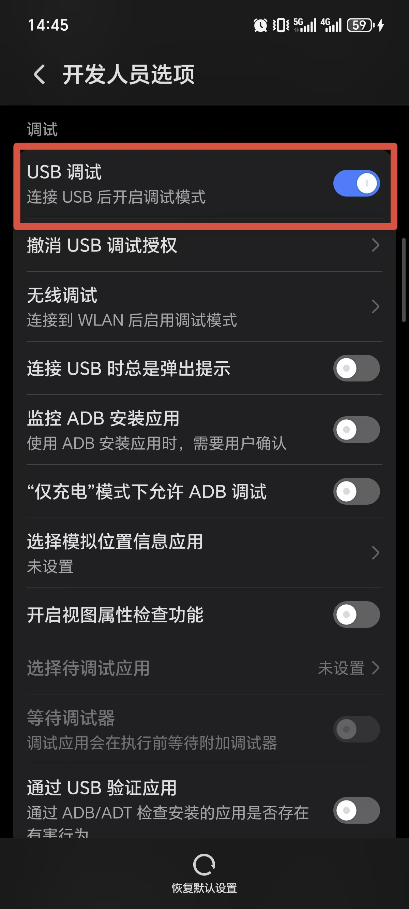
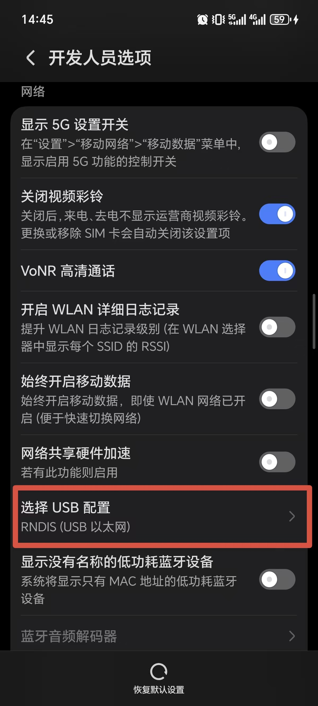

<p align="center">
  <a href="https://github.com/Jiaxi-Huang/DailyCheck-Agent">
    <picture>
      
    </picture>
  </a>
</p>
<p align="center">
  <a href="https://github.com/Jiaxi-Huang/DailyCheck-Agent/actions/workflows/CI.yml"></a>
  <a href="https://github.com/Jiaxi-Huang/DailyCheck-Agent/actions/workflows/codeql-analysis.yml"></a>
</p>
    
A GUI-based agent to help you stay consistent with daily check-ins. Perfect for tracking habits, tasks, or goals with an intuitive interface and customizable features.

**Language**: [English](README.md) | [中文](README-CN.md)

## Table of Contents

- [Quick Start](#quick-start)
- [Installation](#installation)
- [Configuration](#configuration)
- [Usage](#usage)
- [Command Line Options](#command-line-options)
- [License](#license)

---

## Quick Start

```bash
# 1. Clone the repository
git clone https://github.com/Jiaxi-Huang/DailyCheck-Agent.git
cd DailyCheck-Agent

# 2. Install dependencies
pip install .

# 3. Download ADB (scrcpy)
curl -L -o scrcpy-macos-aarch64-v3.3.4.tar.gz https://github.com/Genymobile/scrcpy/releases/download/v3.3.4/scrcpy-macos-aarch64-v3.3.4.tar.gz && \
tar -xzvf scrcpy-macos-aarch64-v3.3.4.tar.gz && \
rm -r scrcpy-macos-aarch64-v3.3.4.tar.gz && \
mv scrcpy-* scrcpy

# 4. Configure API key (edit config/api.yml)

# 5. Run
dailycheck
```

---

## Installation

### Using pip

```bash
# Standard installation
pip install .

# Development mode (with dev dependencies)
pip install -e ".[dev]"
```

### Using uv (Recommended)

```bash
# Standard installation
uv pip install .

# Development mode
uv pip install -e ".[dev]"
```

### Install ADB (scrcpy)

The project requires ADB for device control. You can download it automatically or manually:

```bash
# macOS ARM64
curl -L -o scrcpy-macos-aarch64-v3.3.4.tar.gz https://github.com/Genymobile/scrcpy/releases/download/v3.3.4/scrcpy-macos-aarch64-v3.3.4.tar.gz && \
tar -xzvf scrcpy-macos-aarch64-v3.3.4.tar.gz && \
rm -r scrcpy-macos-aarch64-v3.3.4.tar.gz && \
mv scrcpy-* scrcpy
```

For other platforms, download from [scrcpy releases](https://github.com/Genymobile/scrcpy/releases).

### ADB Setup (Android Device)

Before using DailyCheck-Agent, you need to enable ADB debugging on your Android device:

#### Step 1: Enable Developer Options

1. Open **Settings** on your device
2. Go to **About Phone**
3. Find **Build Number** (or **MIUI Version** on Xiaomi devices)
4. Tap it **7 times** quickly until you see "You are now a developer!"

#### Step 2: Enable USB Debugging

1. Go to **Settings** > **Additional Settings** > **Developer Options**
2. Find and enable **USB Debugging**



#### Step 3: Set USB Configuration to RNDIS

1. In Developer Options, find **USB Configuration** or **Default USB Configuration**
2. Select **RNDIS (USB Ethernet)** mode



> **Note:** The exact menu names may vary depending on your device manufacturer and Android version.

---

## Configuration

### API Configuration

Configure LLM API in `config/api.yml`:

```yaml
api:
  open-router:
    model: "z-ai/glm-4.7-flash"
    api-key: "your-api-key-here"
  siliconflow:
    model: "Pro/zai-org/GLM-4.7"
    api-key: "your-api-key-here"
```

Supported API providers:
- [OpenRouter](https://openrouter.ai/)
- [Siliconflow](https://cloud.siliconflow.cn/)

### Task Configuration

Define tasks in `config/tasks.yml`:

```yaml
tasks:
  taobao_checkin:
    name: "Taobao Check-in"
    app: "Taobao"
    steps:
      - name: "Open app"
        description: "Find and tap the Taobao app icon on home screen"
      - name: "Start check-in"
        description: "Tap the button that starts the daily check session"
      - name: "Open sub page"
        description: "Find and tap the 领淘金币 icon to enter sub page"
      - name: "Complete check-in"
        description: "Tap the 点击签到 button that completes the daily check session"
      - name: "Finish"
        description: "Returned to app home, call task_complete"
```

Task configuration fields:
- `name`: Task display name
- `app`: Target application name
- `steps`: List of task steps, each containing:
  - `name`: Step name
  - `description`: Step description to guide AI in identifying UI elements and actions

---

## Usage

### Option 1: Using `dailycheck` command (Recommended)

```bash
# Basic usage (runs all tasks)
dailycheck

# Specify a task
dailycheck taobao_checkin

# List all available tasks
dailycheck --list-tasks

# With custom options
dailycheck taobao_checkin --api-provider open-router --max-steps 50

# View help
dailycheck --help
```

### Option 2: Using Python module

```bash
python -m dailycheck_agent taobao_checkin
```

### Option 3: Using Shell script (Legacy)

```bash
chmod +x run.sh
./run.sh taobao_checkin open-router
```

### Terminal UI

The agent features a claude-code style terminal UI that displays:

- **Progress bar** - Real-time visualization of task completion
- **Task list** - All tasks with status indicators (○ pending, ● running, ✅ success, ❌ failure)
- **Current action** - Spinner animation with current step count and action description
- **Clean output** - Logs are written to `~/.dailycheck/logs/dailycheck.log`, only errors shown in console

Example output:
```
DailyCheck Agent

[████████████░░░░░░░░░░░░░░░░░] 2/0/5

Tasks:
  ✅ 阿里云盘签到
  ● ▶ 淘宝领取淘金币
      Tap the 淘宝 icon

Progress:
  ⠙ 15/50 Tap the 淘宝 icon
```

---

## Command Line Options

| Option | Short | Default | Description |
|--------|-------|---------|-------------|
| `task_name` | | `taobao_checkin` | Task name (positional argument) |
| `--api-provider` | `-a` | `open-router` | API provider name |
| `--device-serial` | `-d` | Auto-detect | Device serial number |
| `--adb-path` | | `./scrcpy/adb` | ADB executable path |
| `--max-steps` | `-m` | `50` | Maximum execution steps |
| `--config-dir` | | | Configuration directory |
| `--version` | `-v` | | Show version number |


## Project Structure

```
dailycheck-agent/
├── dailycheck_agent/      # Main module
│   ├── __init__.py
│   ├── __main__.py        # Module entry point
│   ├── cli.py             # Command-line interface
│   ├── main.py            # Agent core logic
│   └── lib/
│       ├── api_request.py # LLM API requests
│       ├── config_loader.py # Configuration loader
│       ├── prompt.py      # Prompt builder
│       ├── tui.py         # Terminal UI
│       └── render.py      # Screen renderer
├── config/
│   ├── api.yml            # API configuration
│   ├── tasks.yml          # Task configuration
│   └── prompts.yml        # Prompt templates
├── scrcpy/                # ADB tools
├── tests/                 # Test suite
├── assets/                # Assets 
├── pyproject.toml         # Project configuration
└── run.sh                 # Startup script (legacy)
```

---

## License

This project is licensed under the MIT License - see the [LICENSE](LICENSE) file for details.
